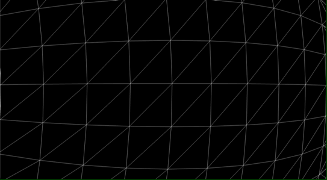

[](https://app.netlify.com/sites/polyomino-puzzle/deploys)

# Polyomino-Puzzle

주어진 게임 보드에 3D 폴리오미노 도형을 적절히 채워 나가는 퍼즐 형식의 웹 게임입니다.

- 배포 주소: <https://polyomino-puzzle.com>

- 해당 게임은 최신 버전의 Chrome, Firefox, Safari에서 지원하고 있습니다.

- 폴리오미노: 크기가 같은 정사각형들을 변이 맞닿게 붙여 하나로 이어 만든 평면 도형

  <image src="./readme-assets/polyomino.png" width="250px" height="150px" title="폴리오미노 이미지" alt="폴리오미노 이미지"/>

# Contents

- [Usage](#usage)
- [Motivation](#motivation)
- [Feature](#feature)
- [Schedule](#schedule)
- [Tech Stack](#tech-stack)
- [Challenges](#challenges)

# Usage

```
git clone https://github.com/chlghks/polyomino-puzzle.git
cd polyomino-puzzle
npm install
npm run start
```

# Motivation

다양한 기능보다는 하나의 확실한 컨셉을 중심으로 프로젝트를 진행하고 싶었습니다.

평소에 3D에 대한 관심이 많았습니다.

3차원이라는 입체적인 공간을 이용해서 무엇인가를 만들어 내는 것 자체에서 큰 매력을 느꼈고,

프로젝트를 구상하던 중 3D 테트리스 앱과 펜타미노 보드게임에서 아이디어를 얻어 3D 퍼즐게임에 대해 프로젝트를 기획하게 되었습니다.

# Feature

<image src="./readme-assets/gamePlay.gif"/>

- 게임이 시작되면 게임 보드와 퍼즐 블럭이 생성됩니다.
- 게임 보드를 회전시킬 수 있습니다.
- 퍼즐 블럭 컨테이너를 회전시킬 수 있습니다.
- Drag and Drop 방식으로 게임 보드에 퍼즐 블럭을 놓을 수 있습니다.
- 게임 보드에 놓은 퍼즐 블럭을 클릭해서 퍼즐 블럭을 다시 놓을 수 있습니다.
- 주어진 퍼즐 블럭으로 게임 보드를 채우면 다음 스테이지로 넘어갑니다.

<image src="./readme-assets/gameEnd.gif"/>

- 주어진 시간 안에 게임 보드를 채우지 못하면 게임이 종료됩니다.
- 게임이 종료되면 점수를 확인할 수 있고 랭킹 등록을 할 수 있습니다.

# Schedule

## 기획 및 구상 [ 9. 27. ~ 10. 1. ]

- 기술스택 검토
- [태스크 카드 작성](https://melon-dresser-15e.notion.site/a026bdda54a54a8894d5a8e70b606488?v=09fb8d07f35d4d4eb182e68f500217a4)
- [Mock up](https://www.figma.com/file/dfAIi0VLO0VdZB6ulAIQYs?embed_host=notion&kind=&node-id=0%3A1&viewer=1)

## 개발 [ 10.4 ~ 15 ]

- 게임 기능 구현
- Netlify 배포

# Tech Stack

- react
- three.js
- react-three-fiber
- react-three/drei
- prop-types
- zustand

# Challenges

## # React-Three-Fiber VS Three.js

프로젝트 특성상 비슷한 블럭을 반복해서 만들어낸다는 특징과 Three.js 렌더링을 위한 구성 요소(scene, light, camera, audio)들이 많다는 부분을 React의 Component로 분리해서 관리하는 것이 코드 재사용성과 가독성 측면에서 더 큰 이점이 있다고 생각했습니다.

## # 3D

새로운 도전을 해보고 싶단 생각을 했고 평소 흥미를 갖고 있던 3D에 대한 도전을 생각하게 되었습니다.

처음 프로젝트를 기획할 때는, 2D에서 벗어나 3D로 생각하는 것이 익숙지 않아 페이지를 구분해서 실제 게임을 플레이하는 페이지만 \<canvas>로 구현하고 그 외 게임 설정, 랭킹 확인 등의 나머지 페이지에 대해서는 \<button> 등 다른 Element로 구현하는 것을 목표로 시작했습니다.  
하지만 프로젝트를 진행하면서 3D에 대해 익숙해지니 페이지로 나눠야 할 요소들을 각각 다른 좌표에 위치시키고 카메라를 컨트롤해서 장면이 전환되는 듯하게 효과를 주는 아이디어가 생각났습니다.  

|  |
|:---:|
| 카메라의 위치와 바라보는 방향을 컨트롤해서 페이지 전환 효과 구현 |

이후 아이디어를 기반으로 모든 요소를 \<canvas> 내에서 3D 요소로 구현할 수 있었습니다.

아이디어 자체에 거창한 변화가 있던 건 아녔지만, 작은 생각의 전환만으로 프로젝트의 전체적인 흐름 자체가 바뀔 수 있다는 경험을 할 수 있었습니다.

## # 퍼즐 블럭 무작위 생성

게임 플레이에 사용되는 블럭들은 스테이지별로 고정된 종류의 블럭을 방향만 무작위로 생성했었습니다.  
하지만 같은 종류의 블럭이 생성되면 사용자 입장에서 정해져 있는 패턴으로 인해 지루함을 느낄 수 있다는 생각했고, 매 스테이지가 시작 될때마다 퍼즐 블럭을 무작위로 생성시켜 불규칙성을 추가해봐야겠다는 생각했습니다.

게임 보드의 좌표(셀) 정보가 담긴 2차원 배열을 BFS 방식으로 순회하며, 현재 선택된 셀을 중심으로 인접한 셀 중 하나를 무작위로 선택하는 방식을 반복해 무작위로 블럭을 만들어내는 알고리즘을 구현했습니다.  
인접한 셀을 무작위로 선택하는 과정에서 고립될 상황에 있는 셀을 우선으로 선택되게 하여 1개의 셀로 이루어진 블럭이 생기는 예외 케이스를 방지했습니다.

## # Frame Drop

게임의 기본적인 요소를 모두 구현하고 나서 Netlify로 배포를 하자 갑자기 게임을 플레이할 때 렌더링의 속도가 느려져 버벅거리는 현상이 있었습니다.  
확인해 보니, 로컬에서는 60FPS를 유지하던 게임이 배포가 된 이후 25FPS까지 Frame Drop이 발생하였습니다.  

크롬 프로파일링을 기능으로 특정 Hook(useFrame)이 실행되는데 로컬에서는 0.92ms 정도였으나 배포 후에는 10.96ms 까지 약 10배 이상의 시간 차이가 있는 것을 확인했습니다.

| <image src="./readme-assets/localProfiling.png"/> | <image src="./readme-assets/deployProfiling.png" /> |
|:---:|:---:|
| 로컬 환경 프로파일링 결과 | 배포 후 프로파일링 결과 |

리서치 결과, 번들링 하는 과정 중 브라우저 호환성을 목적으로 시장 점유율이 0.2% 이상인 모든 브라우저를 지원하기 위해 너무 많은 번들을 생성하게 되어있었고 결과적으로 빌드된 이후 실행을 느리게 하는 원인임을 확인했습니다.

이후 우선적으로 최신 브라우저에 대해 지원하는 것으로 수정해서 해당 문제를 해결했습니다.
또한, 문제를 일으키던 useFrame들의 공통점이 3D 텍스트들을 중앙 정렬시켜주는 역할 중 인 것을 확인했고, useFrame을 사용하지 않고 중앙 정렬되게 리팩토링해서 최적화해 주었습니다.
